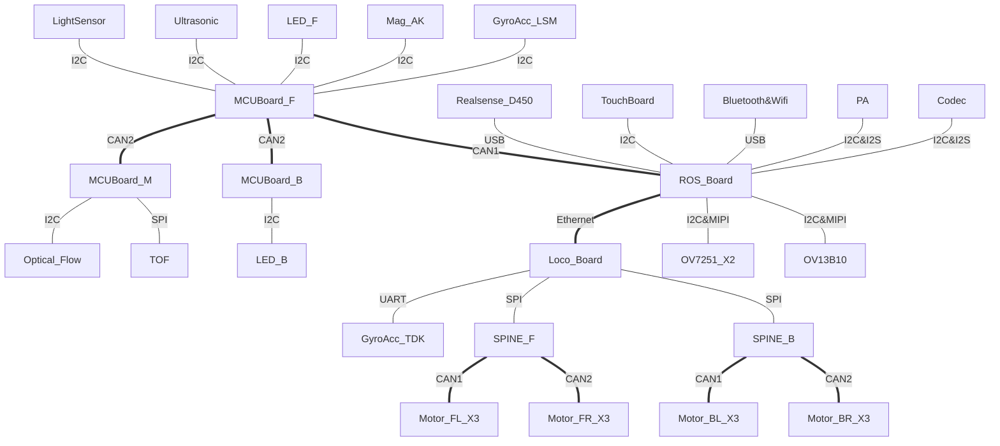
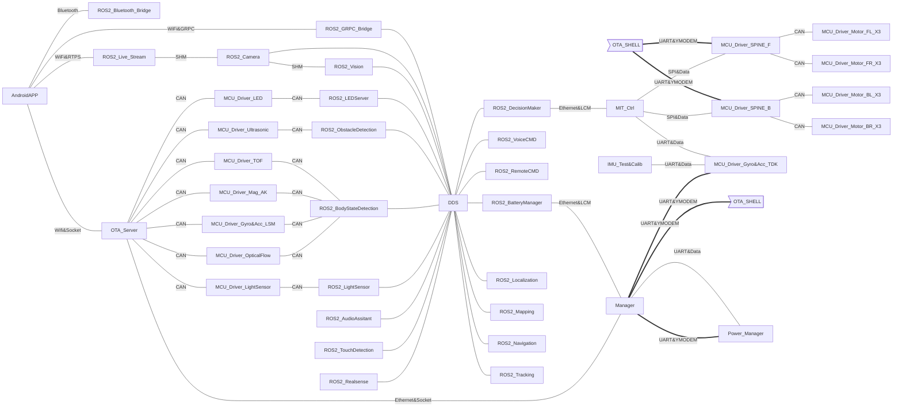

# Xiaomi CyberDog (Athena)

[](https://choosealicense.com/licenses/apache-2.0/)


该项目是小米铁蛋的Repo项目。Athena是项目代号。该项目包含如下Git仓的链接：

- 定制化的LCM消息定义：[athena_lcm_type](https://partner-gitlab.mioffice.cn/cyberdog/athena_lcm_type)
- 嵌入式驱动：[athena_drivers_gd_bin](https://partner-gitlab.mioffice.cn/cyberdog/athena_drivers_gd_bin), [athena_drivers_st](https://partner-gitlab.mioffice.cn/cyberdog/athena_drivers_st)
- Jetson Xavier NX的Linux内核：[athena_kernel](https://partner-gitlab.mioffice.cn/cyberdog/athena_kernel)
- MR813的Linux内核：[TBD](TBD)
- 运动控制代码（目前以二进制方式发行）：[athena_locomotion_bin](https://partner-gitlab.mioffice.cn/cyberdog/athena_locomotion_bin)
- ROS 2的应用：[athena_cyberdog](https://partner-gitlab.mioffice.cn/cyberdog/athena_cyberdog), [athena_assitant](https://partner-gitlab.mioffice.cn/cyberdog/athena_assistant), [athena_automation](https://partner-gitlab.mioffice.cn/cyberdog/athena_automation), [athena_vision](https://partner-gitlab.mioffice.cn/cyberdog/athena_vision)

## 基本信息

- 铁蛋默认用户是`mi`，密码为`123`
- 使用USB线连接`Download`接口，可通过`ssh mi@192.168.55.1`连接铁蛋进行内部操作

## 提前准备

建议提前准备如下：

通过我们提供的`Dockerfile`构建属于您自己的本地化docker。

- [Dockerfile - amd64](dockers/amd64/Dockerfile)
- [Dockerfile - aarch64](dockers/aarch64/Dockerfile)

或者

按照下述内容安装并配置。

- `python3-vcstool`: 查阅页面 [vcstool](http://wiki.ros.org/vcstool) and [GitHub page](https://github.com/dirk-thomas/vcstool) 了解更多内容。
- `gcc-linaro-7.3.1`: 用于编译Jetson Xavier NX内核的交叉编译器（x86-aarch64）[下载链接](https://cdn.cnbj1.fds.api.mi-img.com/build-tool/gcc-linaro-7.3.1-2018.05-x86_64_aarch64-linux-gnu.tar.xz)
- ROS 2(Foxy Fitzroy): 阅读 [ROS 2 安装](TBD) 了解如何讲ROS 2部署到不同的开发环境中。
- MR813 环境: 阅读 [MR813 环境](TBD) 了解如何部署该内容到运动控制板。
- 其他交叉编译器: 安装对应`arm64`和`arm32`CPU架构的交叉编译器到系统。在Ubuntu/Debian系Linux发行版中，该两种工具包名为`gcc-aarch64-linux-gnu`和`gcc-arm-linux-gnueabihf`。
- 铁蛋的完整线刷包: 解压并放到一个固定的位置，确保你有可读权限。阅读 [如何线刷铁蛋](TBD)了解更多。
- 交叉编译相关文件: 在目录[cross_config](TBD)下的一些文件，用于配置交叉编译环境。

## 架构

### 硬件架构

- MCU_Board_F/M/B: 基于STM32
- ROS_Board: 基于NVIDIA Jetson Xavier NX
- Loco_Board: 基于Allwinner MR813



### 软件架构

我们的软件可被分为三个部分：
- 基础软件包（定制的操作系统和开发工具）
- 机器人应用（单片机驱动，控制器程序（基于MIT mini cheetah），基于ROS 2的应用程序）
- 在线升级程序



## 获取代码 & 构建

### 获取代码
1. 添加SSH公钥到你的帐号。参考[SSH Keys](https://partner-gitlab.mioffice.cn/profile/keys)
2. 尝试获取项目代码。

```shell
$ git clone git@partner-gitlab.mioffice.cn:cyberdog/athena_repos.git
$ cd athena_repos
$ mkdir src
$ vcs import . < cyberdog.repos
```

### 构建

请查看每个项目的文档获得更多信息。

- [athena_lcm_type](https://partner-gitlab.mioffice.cn/cyberdog/athena_lcm_type): 定制化的LCM消息定义。
- [athena_drivers_gd_bin](https://partner-gitlab.mioffice.cn/cyberdog/athena_drivers_gd_bin): 电机板、SPI转CAN板、6轴惯性测量单元板和电源管理板的驱动，基于GD32。目前以二进制形式发行，后续会开放源代码。
- [athena_drivers_st](https://partner-gitlab.mioffice.cn/cyberdog/athena_drivers_st): LED、TOF、光感、9轴惯性测量单元、超声传感器和光流计的驱动。基于STM32。
- [athena_kernel](https://partner-gitlab.mioffice.cn/cyberdog/athena_kernel): Jetson Xavier NX的内核。
- [athnea_tina_sdk](https://partner-gitlab.mioffice.cn/cyberdog/athena_tina_sdk): Tina Linux的构建软件包。
- [athena_locomotion_bin](https://partner-gitlab.mioffice.cn/cyberdog/athena_locomotion_bin): 运动控制器。基于MIT mini cheetah。目前以二进制形式发行，后续会开放源代码。
- [athena_cyberdog](https://partner-gitlab.mioffice.cn/cyberdog/athena_cyberdog): ROS 2应用程序的主仓。包含除下面几条外的所有内容。
- [athena_assitant](https://partner-gitlab.mioffice.cn/cyberdog/athena_assistant): 基于小米小爱同学的语音助手的ROS 2桥接包。
- [athena_automation](https://partner-gitlab.mioffice.cn/cyberdog/athena_automation): 基于ROS 2的自动化功能包，包括定位、导航和跟踪等功能包。
- [athena_vision](https://partner-gitlab.mioffice.cn/cyberdog/athena_vision): 基于小米AI计算机视觉的人脸、手势和人体检测和识别的ROS 2桥接包。

## 相关页面

- [产品页](https://www.mi.com/cyberdog)
- [讨论区](https://www.xiaomi.cn/board/27817860)

## 贡献方式

浏览页面[CONTRIBUTING.md](CONTRIBUTING.md)了解如何向铁蛋贡献力量！
