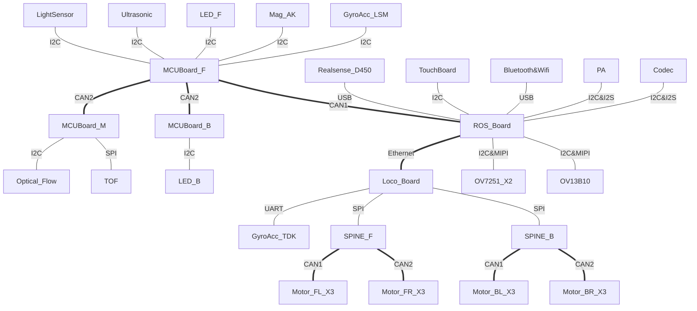
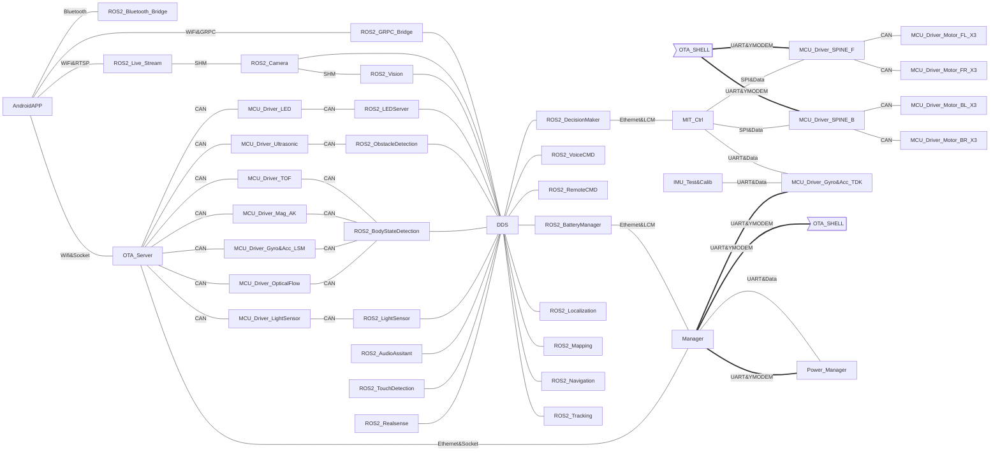

# Xiaomi CyberDog (Athena)

[](https://choosealicense.com/licenses/apache-2.0/)


This is the repos project of Xiaomi CyberDog. Athena is the project code. This project contains git urls of:

- Customized LCM Messages: [athena_lcm_type](https://partner-gitlab.mioffice.cn/cyberdog/athena_lcm_type)
- Embedded Drivers: [athena_drivers_gd_bin](https://partner-gitlab.mioffice.cn/cyberdog/athena_drivers_gd_bin), [athena_drivers_st](https://partner-gitlab.mioffice.cn/cyberdog/athena_drivers_st)
- Linux Kernel of Jetson Xavier NX: [athena_kernel](https://partner-gitlab.mioffice.cn/cyberdog/athena_kernel)
- Linux Kernel & RootFS of MR813: [TBD](TBD)
- Locomotion Code (Bin Currently): [athena_locomotion_bin](https://partner-gitlab.mioffice.cn/cyberdog/athena_locomotion_bin)
- ROS 2 APPs: [athena_cyberdog](https://partner-gitlab.mioffice.cn/cyberdog/athena_cyberdog), [athena_assitant](https://partner-gitlab.mioffice.cn/cyberdog/athena_assistant), [athena_automation](https://partner-gitlab.mioffice.cn/cyberdog/athena_automation), [athena_vision](https://partner-gitlab.mioffice.cn/cyberdog/athena_vision)


## Basic Information

- The default user of CyberDog is `mi`, dafault password is `123`
- You can use a USB cable to connect to the `Download` interface, and use `ssh mi@192.168.55.1` to connect to CyberDog for internal operations

## Before You Begin
---
Before you begin we recommend you prepare:

Building your own docker with our dockerfiles.

- [Dockerfile - amd64](dockers/amd64/Dockerfile)
- [Dockerfile - aarch64](dockers/aarch64/Dockerfile)

or

Installing and configuring as below.

- `python3-vcstool`: See ROS wiki page [vcstool](http://wiki.ros.org/vcstool) and [GitHub page](https://github.com/dirk-thomas/vcstool) for more details.
- `gcc-linaro-7.3.1`: Cross compiler for Linux Kernel of Jetson Xavier NX. [Download link](https://cdn.cnbj1.fds.api.mi-img.com/build-tool/gcc-linaro-7.3.1-2018.05-x86_64_aarch64-linux-gnu.tar.xz)
- ROS 2(Foxy Fitzroy): See [ROS 2 Installation](TBD) to learn ROS 2 deployment under different environment.
- MR813 Environment: See [MR813 Environment](TBD) to learn how to deploy image for locomotion board.
- Cross Compilers: Install cross compilers for arm64 and arm32 target devices. Packages' names are `gcc-aarch64-linux-gnu` and `gcc-arm-linux-gnueabihf` in Ubuntu/Debian Linux Distributions.
- CyberDog EMMC_NVME_Image: Uncompress it into a fixed directory. Make sure you have permission to read. See [Flash your CyberDog](docs/Flashing.md) for more details.
- Cross compiling files: Files under dir [cross_config](TBD).

## Architecture

### Hardware architecture

- MCU_Board_F/M/B: Based on STM32
- ROS_Board: Based on NVIDIA Jetson Xavier NX
- Loco_Board: Based on Allwinner MR813



### Software architecture

Our software are deviced into three parts:
- Basic Software Packages(Customized Operating System and development tools)
- Robotics Applications(MCU drivers, controller code(based on MIT mini cheeath), ROS 2 applications code)
- OTA Software



## Fetch & Build

### Fetch

1. Add your SSH public key to your account. Ref to [SSH Keys](https://partner-gitlab.mioffice.cn/profile/keys).
2. Try to fetch projects:

```shell
$ git clone git@partner-gitlab.mioffice.cn:cyberdog/athena_repos.git
$ cd athena_repos
$ mkdir src
$ vcs import . < cyberdog.repos
```

### Build

Please check documentation in each projects for more information.

- [athena_lcm_type](https://partner-gitlab.mioffice.cn/cyberdog/athena_lcm_type): Customized LCM Messages.
- [athena_drivers_gd_bin](https://partner-gitlab.mioffice.cn/cyberdog/athena_drivers_gd_bin): Drivers of motor, SPIne, 6 axies IMU and power manager. Based on GD32s. Release with binary. Will be opened later.
- [athena_drivers_st](https://partner-gitlab.mioffice.cn/cyberdog/athena_drivers_st): Drivers of LED, TOF, light sensor, 9 axies IMU, ultrasonic sensor and optical flow sensor. Based on STM32s.
- [athena_kernel](https://partner-gitlab.mioffice.cn/cyberdog/athena_kernel): Linux Kernel of Jetson Xavier NX.
- [athnea_tina_sdk](https://partner-gitlab.mioffice.cn/cyberdog/athena_tina_sdk): Building tools of MR813.
- [athena_locomotion_bin](https://partner-gitlab.mioffice.cn/cyberdog/athena_locomotion_bin): Locomotion controller. Based on MIT mini cheetah. Release with binary. Will be opend later.
- [athena_cyberdog](https://partner-gitlab.mioffice.cn/cyberdog/athena_cyberdog): Main ROS 2 apps project. Include all ROS 2 apps except belows.
- [athena_assitant](https://partner-gitlab.mioffice.cn/cyberdog/athena_assistant): Audio assistant ROS 2 bridge based on Xiaomi Xiaoai SDK.
- [athena_automation](https://partner-gitlab.mioffice.cn/cyberdog/athena_automation): Automation applications based on ROS 2.
- [athena_vision](https://partner-gitlab.mioffice.cn/cyberdog/athena_vision): ROS 2 bridge of human faces, gestures and bodies detection & recognition. Based on Xiaomi AI Vision SDK.

## Related Pages

- [Product](https://www.mi.com/cyberdog)
- [Discussion](https://www.xiaomi.cn/board/27817860)

## Contribute

Please refer to the [CONTRIBUTING.md](CONTRIBUTING_EN.md) for a quick read-up about what to consider if you want to contribute.
